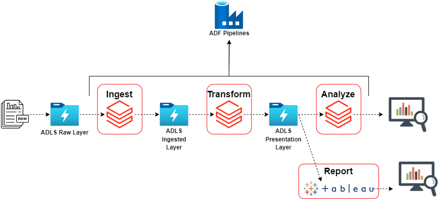

================
Overview
================

.. contents::

.. _project_overview:

Project Overview
================

Have you ever been stuck in an airport because your flight was delayed or cancelled and
wondered if you could have predicted it if you'd had more data?
**Airline on-time Perfromance Analysis** is your chance to find out. It pulls data from the
`Data Expo 2009 <http://stat-computing.org/dataexpo/2009/>`_ and offers a *simple* and
*intuitive* analysis.

Check out the :doc:`user_guide/data` section for more information on data, including a quick view of the
:ref:`data summary <data_structure>`.

.. note::

   This project was done as part of self learning.

The aim of the project is to provide a graphical summary of important features of the data set and answer
some fascinating questions like:

* When is the best time of day/day of week/time of year to fly to minimise delays?

* Do older planes suffer more delays?

* How does the number of people flying between different locations change over time?

* How well does weather predict plane delays?

* Can you detect cascading failures as delays in one airport create delays in others? Are there critical links in the system?

Solution Arhitecture
--------------------

.. note::

    Following are some best practices to come up with a good solution architecture:

    * look at the architecture solution ideas from the documentation or company blogs

    * do some research to build data pipelines using the learnings from industry experts in order to avoid starting from scratch, and to get good ground to start a project from

    * explore places where one can find good architectures like `Azure Architectures <https://learn.microsoft.com/en-us/azure/architecture/browse/>`_

Document Structure
==================

Documentation has been moduled in the following sections

    |-- **Overview**

        |-- **Project Overview** : This section describes the overall objective of this project and a bird's eye view of the solution involved. Refer here: :ref:`project_overview`

        |-- **Documentation Structure**: Brief Description of the flow of the entire documentation and suggested reading order.

    |-- **Developer Guide**: This section details the backend processes including tools used and processing piplines.

        |-- **Data Source**: Informs the nature of data and the sources from where it is derived. Refer here: :ref:`data_source`

        |-- **Tech Stack**

            |-- Azure Databricks - A high level introduction to Azure Databricks and how its used in the project. Refer here :ref:`databricks`

            |-- ADLS - An introduction to Azure Delta Lake Storage (ADLS) and its uses are discussed here. Refer here: :ref:`azure`

            |-- PySpark - Provides brief summary of Spark cluster architecture and its python API PySpark. Refer here :ref:`pyspark`

            |-- SQL - Provides a gist of how SQL is used as part of our analysis. Refer here :ref:`sql`

        |-- **Production Pipelines**

            |-- Data Ingestion: Lists all the data ingestion requirements and the steps involved. Refer here: :ref:`data_ingestion`

            |-- Data Transformation: Lists all the data transformation requirements and the steps involved. Refer here: :ref:`data_transformation`

            |-- Scheduling: Lists the scheduling and non-functional requirements. Refer here: :ref:`scheduling`

    |-- **User Guide**

        |-- **Overview**: Purpose of the user guide. Recommended for any business user of the applications. Refer here: :ref:`user_overview`

        |-- **Data**: A table encapsulating the purpose of various datasets along with a blueprint. Refer here: :ref:`data`

        |-- **Analysis**: Refer here: :ref:`analysis`

        |-- **Reports**: Refer here: :ref:`reports`
